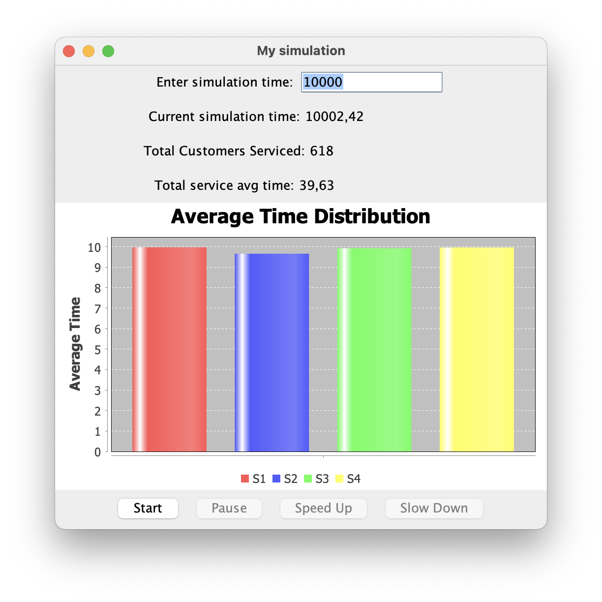

## Intro

The objective of the group’s prject work is to develop a comprehensive simulator for a supermarket queue system, 
specifically focusing on the customer arrival and cashier selection process. In this simulation, 
customers arrive at the cash line and strategically choose the cashier with the least number of people waiting at 
the time of their arrival. The primary goal is to model and analyze the dynamic interactions within the supermarket queue,
simulating the customer flow and cashier utilization.

### Vision

We think that our simulation can help to understand supermarket behaviour and it can be used for modeling this. 
It can be improved to be more complex and then it can be more beneficial.

    

